# 基于51单片机带WIFI和陀螺仪的超声波测距
## 硬件
### STC15W核心板（具体型号是IAP15W4K58S4）（IAP本身就是仿真器）
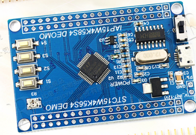
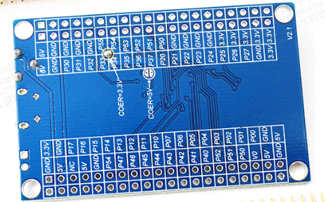
[购买链接](https://detail.tmall.com/item.htm?spm=a230r.1.14.21.2f6c56e22jcJfI&id=557384797301&ns=1&abbucket=9)
### WIFI模块（ESP-01或者ESP-01S使用其中一种就可以）
- ESP-01
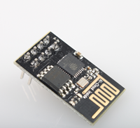
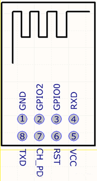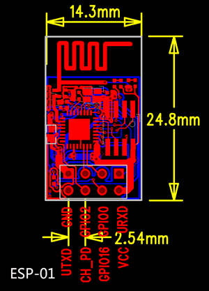
[购买链接](https://item.taobao.com/item.htm?spm=a1z10.5-c.w4002-16491566042.32.39426b051rhAKU&id=543546250892)
接线图（其中两个电阻选择200欧左右的）
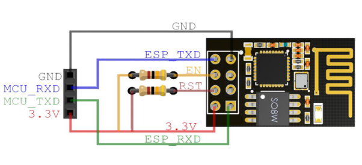

- ESP-01S
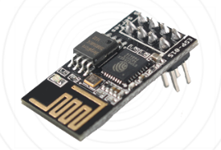
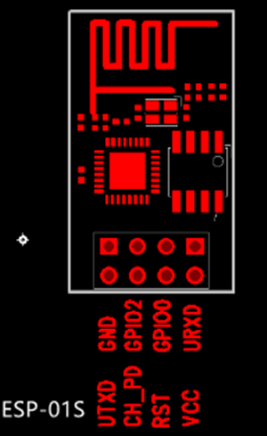
[购买链接](https://item.taobao.com/item.htm?spm=a1z10.5-c.w4002-16491566042.17.39426b051rhAKU&id=543468772547)
接线图（和ESP-01区别就是RTS和CH_PD可以悬空）
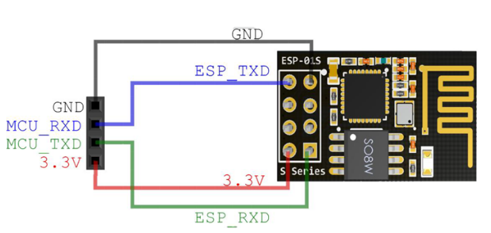
### WIFI模块供电
- 方案1：使用STC15W核心板供电（3.3V输出）
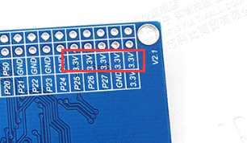

- 方案2：单独使用稳压模块（AMS1117-3.3）
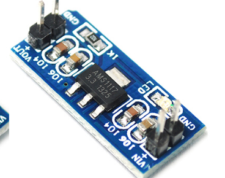
[购买链接](https://detail.tmall.com/item.htm?spm=a230r.1.14.16.7aca57feVobUKb&id=13301101281&ns=1&abbucket=9&skuId=4002251492046) 注意：是3.3V的不要买错了
### 陀螺仪模块 
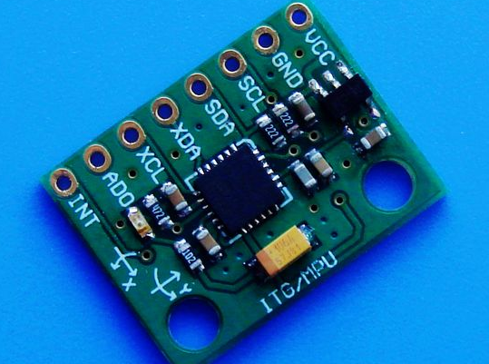

[购买链接](https://detail.tmall.com/item.htm?spm=a1z10.3-b-s.w4011-21581912015.43.74ad5535nkgydB&id=21261751847&rn=a5c25e3493dec2ccf27523b415d1afeb&abbucket=9&skuId=4359616039028)注意：是购买`MPU6050 三维角度加速度陀螺仪传感器 6DOF三轴 （1个）`型号
### 超声波模块（HC-SR04或者HC-SR05）（HC-SR05只是多了一个开关量输出其他和04一样）
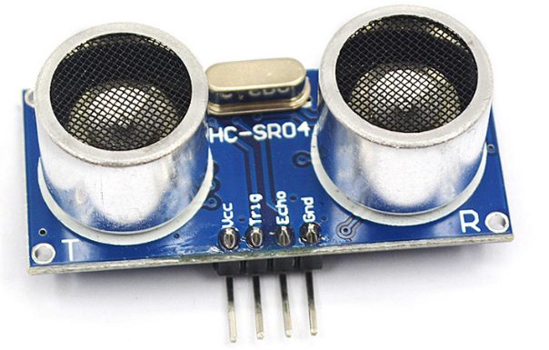
[购买链接](https://detail.tmall.com/item.htm?spm=a1z10.3-b-s.w4011-21581912015.51.4cfe5535fcPRrl&id=12632417946&rn=1cbed167183be0e65e5924e48b1305ab&skuId=3894573644499)
### 硬件连接图
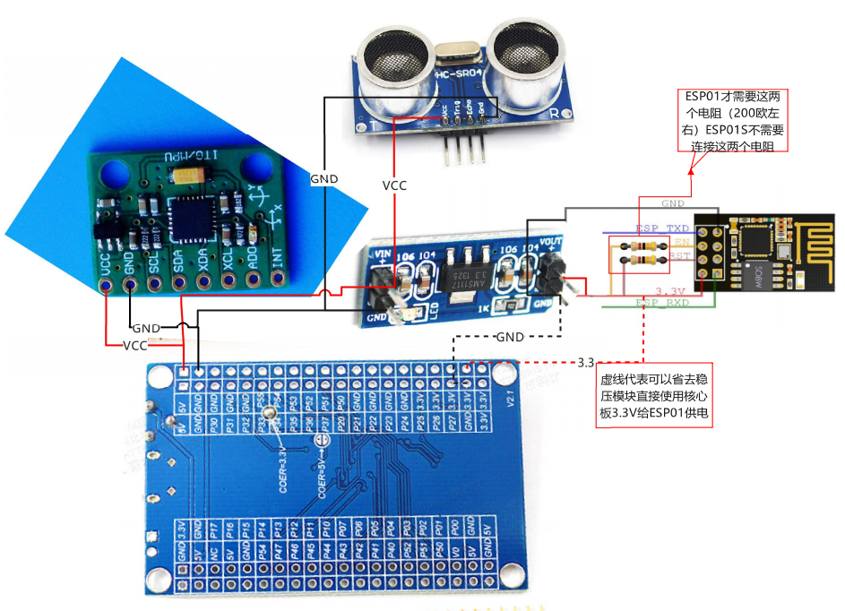

## 配置ESP-01模块波特率（出厂默认115200）
- 使用串口工具`tools\串口调试工具\sscom5.13.1.exe`发送指令(要输入回车表示命令结束)

```
AT+UART=9600,8,1,0,0

```
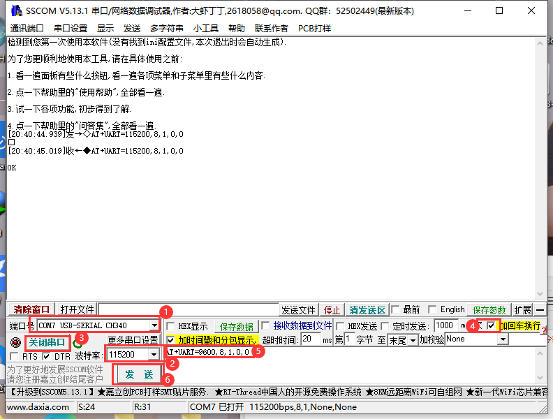
- 设置成功还回OK如下

```
[20:43:25.256]发→◇AT+UART=9600,8,1,0,0
□
[20:43:25.262]收←◆AT+UART=9600,8,1,0,0

OK
```